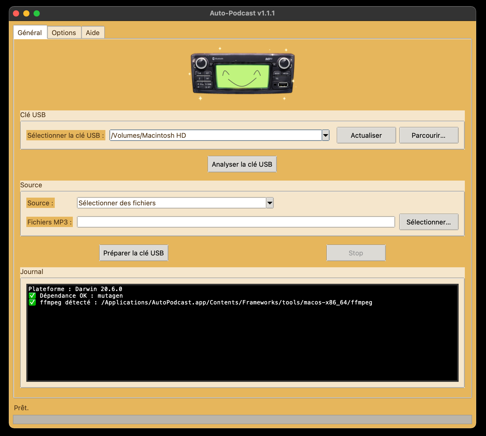
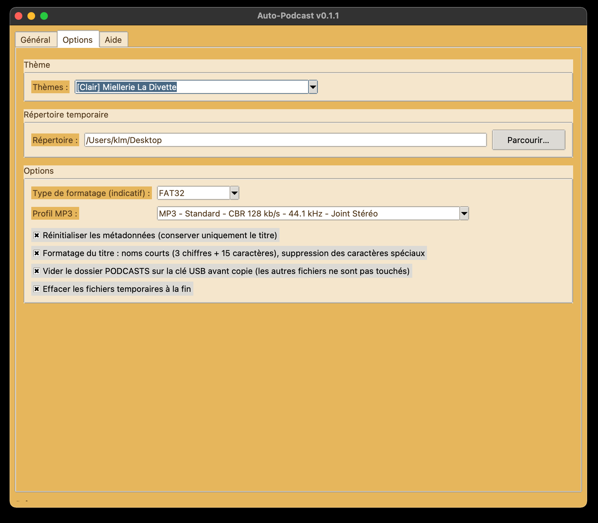
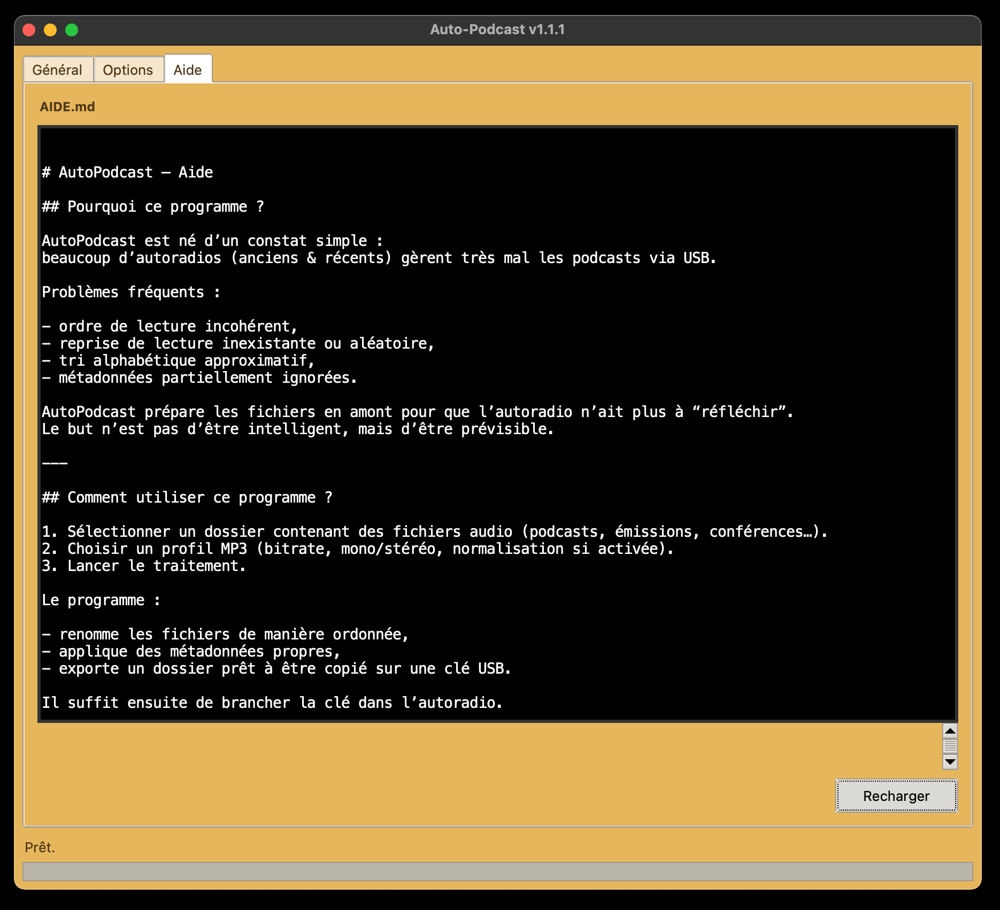

# AutoPodcast

AutoPodcast est un outil Python destiné à préparer des podcasts et contenus audio
pour une lecture fiable sur autoradios USB.

Il répond à un problème simple et toujours actuel :  
de nombreux autoradios, anciens comme récents, gèrent très mal l’ordre de lecture,
les métadonnées et la reprise lorsqu’on utilise une clé USB.

AutoPodcast prépare les fichiers **en amont**, de manière déterministe.

---

## 👁️ Aperçu

---

## 📥 Téléchargement

## 💾 Applications standalone (recommandé)

- 🐧 **Linux**  
  -  [AutoPodcast-1.1.5-linux-x86_64.AppImage](https://github.com/mrklm/autopodcast/releases)
  -  [AutoPodcast-1.1.5-linux-x86_64.tar.gz](https://github.com/mrklm/autopodcast/releases)

- 🍎 **macOS**
  -  [AutoPodcast-vv1.1.2-macOS-x86_64.dmg](https://github.com/mrklm/autopodcast/releases)

- 🪟 **Windows**  
  -  [AutoPodcast-windows-x86_64-v1.1.7.zip ](https://github.com/mrklm/autopodcast/releases)

--- 

## Objectif du projet

- Forcer un ordre de lecture clair et stable
- Générer des fichiers audio compatibles avec des autoradios simples
- Éviter les tris aléatoires et les reprises incohérentes
- Fonctionner sans dépendre d’une application mobile ou d’un réseau

Ce projet ne cherche pas à remplacer une application de podcast moderne,
mais à rendre **fiable** un environnement contraint.

---

## Fonctionnalités principales

- Interface graphique (Tkinter / ttk)
- Conversion et traitement audio via ffmpeg
- Écriture de métadonnées (ID3)
- Numérotation explicite des fichiers
- options de normalisation
- Thème de couleurs persistant
- Aide intégrée via un fichier Markdown
- 

📜 Licence

Ce logiciel est distribué sous la GNU General Public License v3.0.

🛠️ Contribuer

Les contributions sont les bienvenues via Pull Requests.

⚠️ Avertissement

Ce logiciel est fourni sans garantie. L'auteur décline toute responsabilité en cas de dommage ou de dysfonctionnement.

💡 Pourquoi ce projet est-il sous licence libre ?

Ce projet s'inscrit dans la philosophie du logiciel libre, promue par des associations comme April.

le partage des connaissances et des outils est essentiel pour une société numérique plus juste et transparente.

📬 Contact:

clementmorel@free.fr
