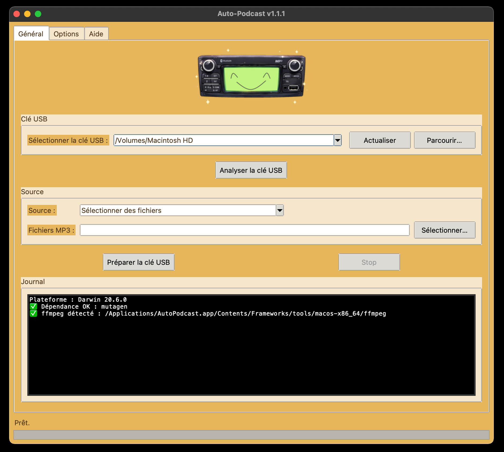
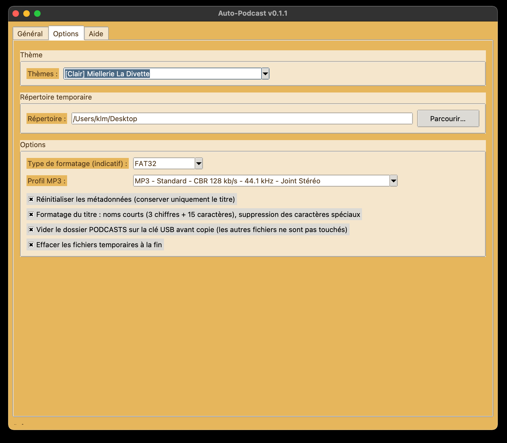
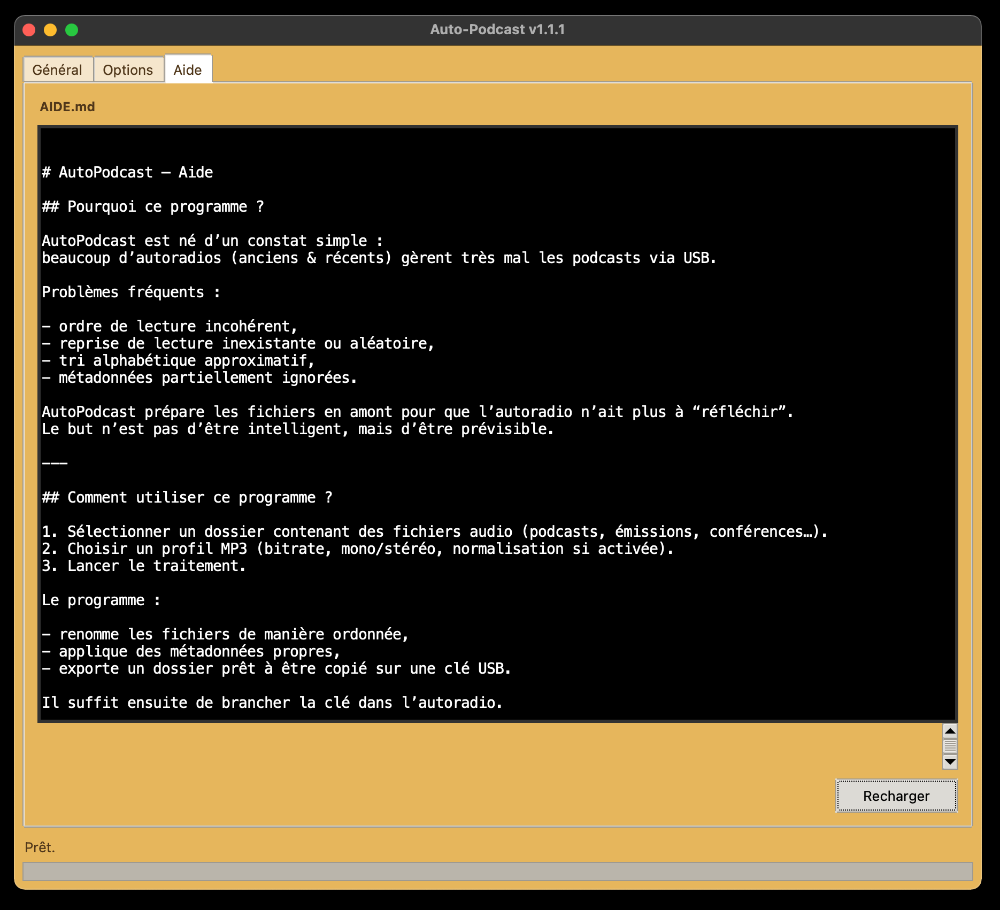

# AutoPodcast

AutoPodcast est un outil Python destiné à préparer des podcasts et contenus audio
pour une lecture fiable sur autoradios USB.

Il répond à un problème simple et toujours actuel :  
de nombreux autoradios, anciens comme récents, gèrent très mal l’ordre de lecture,
les métadonnées et la reprise lorsqu’on utilise une clé USB.

AutoPodcast prépare les fichiers **en amont**, de manière déterministe.

---

## 👁️ Aperçu

---

## 📥 Téléchargement

## 💾 Applications standalone (recommandé)

- 🐧 **Linux**  
  -  [AutoPodcast-linux-x86_64-v1.1.11.AppImage](https://github.com/mrklm/autopodcast/releases)
  -  [AutoPodcast-1.1.11-linux-x86_64.tar.gz](https://github.com/mrklm/autopodcast/releases)

- 🍎 **macOS**
  -  [AutoPodcast-v1.1.11-macOS-x86_64.dmg](https://github.com/mrklm/autopodcast/releases)

- 🪟 **Windows**  
  -  [AutoPodcast-windows-x86_64-v1.1.11.zip](https://github.com/mrklm/autopodcast/releases)

--- 

## Builds et releases automatiques

Le workflow `.github/workflows/release.yml` construit Linux x86_64 (AppImage et
tar.gz), Windows x86_64 (ZIP) et macOS Intel (DMG). Il embarque FFmpeg depuis les
wheels de [imageio-ffmpeg](https://github.com/imageio/imageio-ffmpeg), exécute les
tests et vérifie les SHA256 avant de publier une release commune.

Pour construire la **1.1.11**, une fois le workflow poussé sur `main` : ouvrir
**Actions → Build and release AutoPodcast → Run workflow**, sélectionner `main`
et conserver la version `1.1.11`. Les trois builds doivent réussir avant la
publication de la release `v1.1.11`. Les artefacts des builds réussis restent
également disponibles dans Actions pendant 14 jours.

Pour les versions suivantes, mettre à jour `APP_VERSION` et le changelog, puis
pousser un tag `vX.Y.Z` : le workflow se déclenche automatiquement. La version du
tag (ou du lancement manuel) doit correspondre à celle du code. Une release
existante n'est pas écrasée ; un tag existant doit pointer vers le commit construit.
Le workflow utilise le `GITHUB_TOKEN` fourni par GitHub, sans secret supplémentaire.

Le DMG standard est construit sur `macos-15-intel` ; il ne garantit pas la
compatibilité High Sierra. Le script dédié High Sierra reste à lancer dans son
environnement spécifique. Les builds ne sont pas signés avec un certificat
Windows ou Apple et le DMG n'est pas notarié.

## Objectif du projet

- Forcer un ordre de lecture clair et stable
- Générer des fichiers audio compatibles avec des autoradios simples
- Éviter les tris aléatoires et les reprises incohérentes
- Fonctionner sans dépendre d’une application mobile ou d’un réseau

Ce projet ne cherche pas à remplacer une application de podcast moderne,
mais à rendre **fiable** un environnement contraint.

---

## Fonctionnalités principales

- Interface graphique (Tkinter / ttk)
- Conversion et traitement audio via ffmpeg
- Écriture de métadonnées (ID3)
- Numérotation explicite des fichiers
- options de normalisation
- Thème de couleurs persistant
- Aide intégrée via un fichier Markdown
- 

📜 Licence

Ce logiciel est distribué sous la GNU General Public License v3.0.

🛠️ Contribuer

Les contributions sont les bienvenues via Pull Requests.

⚠️ Avertissement

Ce logiciel est fourni sans garantie. L'auteur décline toute responsabilité en cas de dommage ou de dysfonctionnement.

💡 Pourquoi ce projet est-il sous licence libre ?

Ce projet s'inscrit dans la philosophie du logiciel libre, promue par des associations comme April.

le partage des connaissances et des outils est essentiel pour une société numérique plus juste et transparente.

📬 Contact:

clementmorel@free.fr
